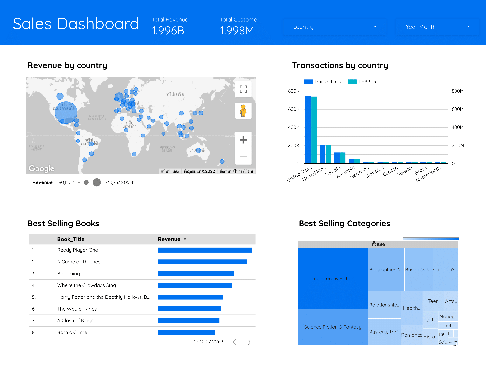
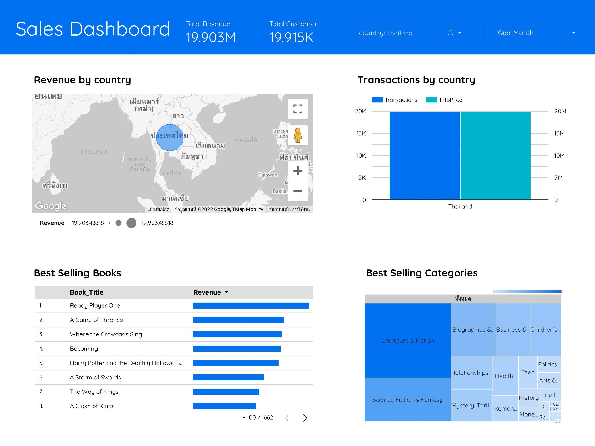

# สร้าง Dash Board โดยใช้ Google data Studio

- ทั่วโลกมียอดขายทั้งสิ้น 1.996 พันล้านบาท
- มีจำนวนลูกค้ารวมทั้งสิ้น 1.998 ล้านราย
- ประเทศสหรัฐอเมริกามีการทำรายการซื้อ audible books สูงที่สุด
- มีรายได้จากการขายในประเทศสหรัฐอเมริกาสูงที่สุด ประมาณ 740 พันล้านบาท
- หนังสือที่ขายดีที่สุด 5 อันดับแรก ได้แก่
    1. Ready Player One
    2. A Game of Thrones
    3. Where the Crawdads Sing
    4. Becoming
    5. Harry Potter and the Deathly Hallows, Book 7
- ประเภทของหนังสือที่ขายดีที่สุดคือ Literature and Fiction

- ประเทศไทยมียอดขายทั้งสิ้น 19.903 ล้านบาท
- มีจำนวนลูกค้าทั้งสิ้น 19,915 ราย
- หนังสือที่ขายดีที่สุดในไทย 5 อันดับแรก ได้แก่
    1. Ready Player One
    2. A Game of Thrones
    3. Where the Crawdads Sing
    4. Becoming
    5. Harry Potter and the Deathly Hallows, Book 7
- ประเภทของหนังสือที่ขายดีที่สุดคือ Literature an
